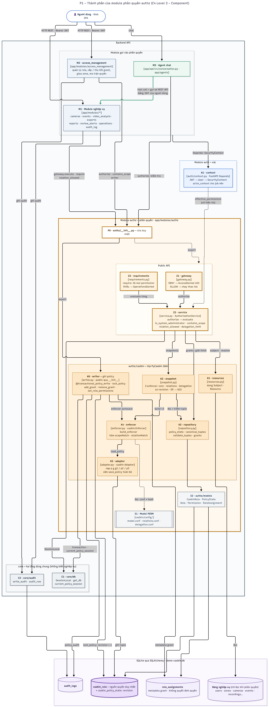
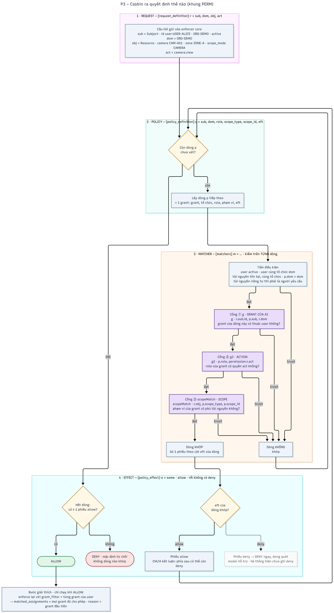

# Báo cáo: Hệ thống phân quyền và Casbin

Báo cáo lần này em tập trung vào phần phân quyền của hệ thống: code được tổ chức lại thế nào, quyền được lưu ra sao, và Casbin thực sự đánh giá một yêu cầu như thế nào. Phần Agent và trace log em xin trình bày ở buổi sau.

---

## 1. Các vấn đề từ buổi báo cáo trước

- Cấu trúc code chưa rõ, các module để lẫn lộn, chưa chia theo nghiệp vụ.
- Chưa giải thích được Casbin evaluate thế nào, tại sao casbin lại phải chạy loop toàn bộ thay vì gặp allow rồi dừng luôn
- Cần sơ đồ C4 để hiểu hệ thống gồm những cấu phần nào, dùng công nghệ gì, cấu hình ở đâu.
- Cần làm rõ cách Casbin hoạt động, đặc biệt là phần evaluate.
- Cần sequence diagram mô tả cách Casbin evaluate action và scope.
- Agent: chưa rõ theo mô hình nào, các cấu phần giao tiếp với nhau ra sao.
- Trace log còn mờ, chưa thấy Agent plan gì, gọi tool nào, cây quyết định thế nào. Nên đưa sang Langfuse hoặc LangChain.

---

## 2. Những vấn đề giải quyết trong báo cáo này

Lần này em xử lý các vấn đề liên quan đến cấu trúc code và phân quyền:

- [Cấu trúc code và cách chia module](#cau-truc-code)
- [Casbin evaluate thế nào: vì sao gặp allow rồi vẫn phải quét tiếp](#casbin-evaluate)
- [Sơ đồ C4 cho cấu phần phân quyền (P1)](#p1)
- [Quyền được lưu như thế nào (P2)](#p2)
- [Casbin ra quyết định ra sao (P3)](#p3)
- [Sequence diagram một request đi qua phân quyền (P4)](#p4)

---

<a id="tong-quan"></a>
## 3. Tổng quan phân quyền

Hệ thống phân quyền theo vai trò (RBAC), nhưng mỗi vai trò luôn gắn với một **tổ chức** và một **phạm vi** (toàn bộ, một zone, hoặc một camera).

- `casbin_rule` là **nguồn quyền duy nhất**. Các bảng khác có nhắc tới role hay zone chỉ để hiển thị.
- Mọi module muốn hỏi quyền đều đi qua **một cửa** là module `authz`.

Dùng 4 sơ đồ, đi từ tổng quát vào chi tiết:

| Sơ đồ | Trả lời câu hỏi | Loại sơ đồ |
|---|---|---|
| P1 | Phân quyền gồm những cấu phần nào | C4 Component |
| P2 | Quyền được lưu như thế nào | UML Class |
| P3 | Casbin quyết định ALLOW / DENY ra sao | Activity |
| P4 | Một request đi qua code theo thứ tự nào | Sequence |

---

<a id="cau-truc-code"></a>
## 4. Cấu trúc code và cách chia module

Đã refactor backend theo hướng **Modular Monolith**, code được chia theo nghiệp vụ.

- `backend/app/modules/` gồm 12 module: `accounts`, `auth`, `authz`, `access_management`, `cameras`, `events`, `video_analysis`, `exports`, `reports`, `review_alerts`, `operations`, `audit_log`.
- Phần hạ tầng dùng chung (kết nối DB, ghi audit) tách ra `core/`.
- Ranh giới giữa các module có test tự động kiểm (`tests/unit/test_module_boundaries.py`). Ví dụ module khác import thẳng vào bên trong `authz` là test báo lỗi.

Phần Agent hiện vẫn nằm ở `agents/`, `mcp/` và `api/v1/conversation.py`. Em sẽ gom lại thành một module khi làm phần Agent.

---

<a id="casbin-evaluate"></a>
## 5. Vấn đề 1: Casbin evaluate thế nào: vì sao gặp allow rồi vẫn phải quét tiếp

Khi có một câu hỏi như "alice có được xem camera CAM-A01 không", Casbin **không chọn một grant** để trả lời. Nó thử lần lượt **mọi dòng luật**. Dòng nào áp dụng được cho câu hỏi thì gọi là *khớp*, và dòng đó bỏ một phiếu theo cột `eft` của nó: `allow` (cho phép) hoặc `deny` (cấm).

Luật gộp phiếu trong `model.conf` là:

```
e = some(where (p.eft == allow)) && !some(where (p.eft == deny))
```

tức là **có ít nhất một phiếu allow và không có phiếu deny nào** thì mới ALLOW. Vì vậy:

- Gặp một dòng khớp `deny` → chắc chắn DENY, Casbin **dừng luôn**.
- Gặp một dòng khớp `allow` → **chưa** kết luận được, vì phía sau có thể còn dòng deny, nên phải **quét tiếp đến hết**.

### Ví dụ: hai grant cùng phủ một camera, nhưng cần chặn

alice có 2 grant cùng cho xem CAM-A01: Role cho xem mọi cam ở **ZONE-A** (CAM-A01 nằm trong ZONE-A) và Role cho xem mỗi **CAM-A01**. Giờ CAM-A01 đang phục vụ điều tra, cần chặn alice xem camera này nhưng vẫn cho xem phần còn lại của ZONE-A.

Nếu chỉ dùng allow thì khó: thu hồi grant CAM-A01 thì alice vẫn xem được nhờ ZONE-A; thu hồi luôn ZONE-A thì alice mất cả CAM-A02, phải cấp lại từng camera, và camera lắp mới sau này cũng không được tự động phủ.

Cách gọn hơn là thêm **một grant `deny`** cho CAM-A01. Lúc này alice có 3 grant:

| Grant | Role | Phạm vi | eft |
|---|---|---|---|
| ASSIGN-ALICE-ZONE-A | Security Viewer | ZONE-A | allow |
| ASSIGN-ALICE-CAM-A01 | Security Viewer | CAM-A01 | allow |
| ASSIGN-ALICE-BLOCK-A01 | Camera Manager | CAM-A01 | **deny** |

Khi alice hỏi **xem CAM-A01**, Casbin so khớp từng grant qua 3 cổng:

| Grant | ① g: của alice? | ② g2: role có `camera.view`? | ③ scope: phủ CAM-A01? | Kết quả |
|---|---|---|---|---|
| ZONE-A | ✓ | ✓ | ✓ CAM-A01 thuộc ZONE-A | khớp hết → allow |
| CAM-A01 | ✓ | ✓ | ✓ | khớp hết → allow |
| BLOCK-A01 | ✓ | ✓ | ✓ | khớp hết → nhưng **deny** |

Cả 3 grant đều khớp, được 2 phiếu allow và 1 phiếu deny. Theo luật gộp phiếu, chỉ cần có deny là **DENY**.
Đây cũng là lý do Casbin phải quét hết: grant ZONE-A nằm trước và đã cho phiếu allow. Nếu Casbin dừng ngay ở đó thì nó trả ALLOW cho CAM-A01, sai.


<a id="p1"></a>
## 6. P1 – Component Diagram của C4 Diagram
Em ko làm lv 1 và 2 vì phần casbin này nó là module nằm ngay bên trong backend luôn nên ở lv 1 2 phần phân quyền chưa xuất hiện.

Diagram này cho thấy module phân quyền `authz` gồm những khối code nào, mỗi khối nằm ở đâu và làm gì, các module khác (nghiệp vụ, quản lý quyền, Agent) đi vào phân quyền qua đâu, và phân quyền đọc cấu hình, dữ liệu ở đâu.



1. **3 đường vào:** trang nghiệp vụ như xem camera, sự kiện (M1); trang quản lý quyền (M2), là chỗ duy nhất thay đổi quyền; và chat với Agent (M3).
2. **A1 – xác thực:** giải mã JWT, kiểm user, tạo `SecurityContext`. Đây là "bạn là ai", chưa phải "bạn được làm gì".
3. **P0 – cửa vào duy nhất** của module `authz`. Module khác chỉ được dùng những gì P0 cho phép; import thẳng vào bên trong là test báo lỗi.
4. **Public API:** `service.py` (Z2) là nơi duy nhất thật sự hỏi Casbin. `gateway.py` (Z1, kiểm 1 quyền) và `requirements.py` (Z3, kiểm nhiều quyền) chỉ là hàm bọc cho gọn.
5. **Bên trong Z2:** chuẩn bị bộ luật (K2–K5 đọc và kiểm `casbin_rule`, dựng enforcer từ 3 file `.conf`) → chuẩn bị câu hỏi (K1 đọc user, camera, zone) → hỏi Casbin → giải thích grant nào đã cho phép.
6. **K6 – `writer.py`:** chỗ duy nhất ghi quyền, luôn trong một transaction; lỗi ở đâu cũng rollback hết.
7. **Dưới cùng:** cấu hình `.conf`, các bảng dữ liệu (`casbin_rule` là nguồn quyền duy nhất) và `core` (DB, audit). Phụ thuộc chỉ đi một chiều: module nghiệp vụ → authz → core.

Agent hỏi quyền hai lần: lần 1 để từ chối sớm; lần 2 (mũi tên xanh lá) là khi Agent gọi lại REST API bằng JWT của người dùng, và module nghiệp vụ lại tự hỏi quyền. Vì vậy Agent không thể làm được việc mà người dùng không có quyền làm.

---

<a id="p2"></a>
## 7. P2 – Quyền được lưu như thế nào

Sơ đồ này cho thấy một quyền như "alice được xem camera ở ZONE-A" được lưu trong db như nào


Mỗi ô là một bảng trong `casbin_rule` db.

1. **① User:** người dùng - các cột liên quan đến quyền.
2. **② Grant:** một lần gán role cho user ở một phạm vi, gồm 1 dòng `g` (ai sở hữu) và 1 dòng `p` (role gì, ở đâu).
3. **③ Role:** grant mang role nào.
4. **④ Permission:** role có những quyền gì (`g2`).
5. **⑤ Phạm vi:** grant áp dụng ở đâu: toàn tổ chức, một zone hay một camera.
6. **⑥ Ví dụ trong hệ thống:** các dòng `casbin_rule` của alice trong seed.
7. **⑦ Phần phụ:** `p2` (luật phiếu review-alert), `p3` (giới hạn zone khi ủy quyền) và số phiên bản policy.
8. **⑧ Không quyết định quyền:** những thứ trông giống quyền nhưng Casbin không đọc, như `users.role_id`, `role_assignments`.

---

<a id="p3"></a>
## 8. P3 – Casbin ra quyết định như thế nào

Sơ đồ này cho thấy bên trong Casbin làm gì khi nhận câu hỏi, ví dụ "alice có được xem CAM-A01 không": lần lượt lấy từng dòng luật, cho qua 3 cổng kiểm (grant của ai, role có quyền không, phạm vi có phủ không), rồi gộp kết quả thành ALLOW hoặc DENY.



Sơ đồ chia 4 vùng.

1. **Request:** câu hỏi gồm 4 phần: ai, tổ chức nào, tài nguyên nào, hành động gì. Ví dụ (alice, ORG-DEMO, CAM-A01, `camera.view`).
2. **Policy:** Casbin lấy lần lượt từng dòng `p`, tức từng grant của mọi user.
3. **Matcher:** mỗi dòng phải qua các điều kiện chung (user còn hoạt động, cùng tổ chức, tài nguyên tồn tại) rồi 3 cổng:
   - ① `g`: grant có phải của người đang hỏi không;
   - ② `g2`: role có quyền làm hành động đó không (**action**);
   - ③ `scopeMatch`: phạm vi có phủ tài nguyên không (**scope**).

   Trượt ở đâu thì dòng đó không khớp, quay lại lấy dòng tiếp theo.
4. **Effect:** dòng khớp bỏ phiếu theo `eft`. Hết dòng, có ít nhất 1 allow và không có deny thì ALLOW, ngược lại DENY.
5. **Bước giải thích:** khi đã ALLOW, hệ thống hỏi lại từng grant để biết grant nào đã cho phép, dùng cho hiển thị và audit.

---

<a id="p4"></a>
## 9. P4 – Một request đi qua hệ thống phân quyền (Sequence Diagram)

Diagram này cho biết một request thật, alice mở `GET /cameras/{id}`, đi qua những thành phần nào theo thứ tự thời gian: xác thực, gateway, chuẩn bị bộ luật, chuẩn bị câu hỏi, Casbin quyết định, rồi rẽ hai nhánh ALLOW (CAM-A01, trả 200) và DENY (CAM-B01, trả 403).


1. **Bước 1–4, xác thực:** alice gửi request kèm JWT, AuthN kiểm và trả `SecurityContext`.
2. **Bước 5–6, vào cửa:** endpoint không tự kiểm quyền mà giao cho gateway; gateway gọi `authorize`.
3. **Bước 7–12, chuẩn bị bộ luật:** đọc và kiểm toàn bộ `casbin_rule`, dựng enforcer. Dữ liệu không hợp lệ hoặc vừa bị sửa giữa chừng thì trả 503 (bước 11).
4. **Bước 13–14, chuẩn bị câu hỏi:** đọc user và camera để biết alice thuộc tổ chức nào, camera nằm ở zone nào.
5. **Bước 15–16, quyết định:** gọi `enforce`, Casbin trả True / False (bên trong là P3).
6. **Bước 17–18, danh sách camera được phép:** chạy ở cả hai nhánh, dùng cho hiển thị và để chọn lý do khi từ chối.
7. **Bước 19–23, nhánh ALLOW (CAM-A01):** tìm grant nào đã cho phép, gateway cho chạy thao tác đọc camera, trả 200.
8. **Bước 24–27, nhánh DENY (CAM-B01):** tính lý do từ chối, gateway chặn, người dùng nhận 403. Lý do chỉ dùng nội bộ, không trả ra ngoài.

---

<a id="tiep-theo"></a>
## 10. Các nhiệm vụ tiếp theo

- **Agent:** vẽ sơ đồ cấu phần, làm rõ mô hình điều phối và cách các thành phần giao tiếp, đồng thời gom code Agent thành một module riêng.
- **Trace log:** đưa trace sang Langfuse để xem được Agent plan gì, gọi tool nào và rẽ nhánh ra sao.

---
