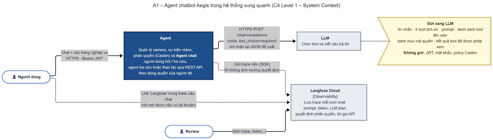
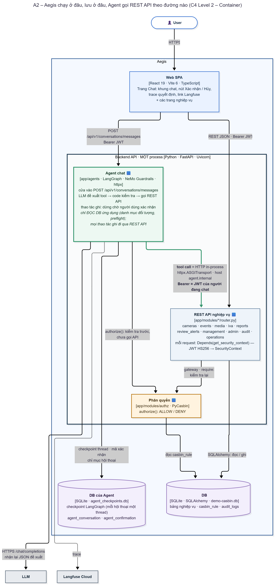
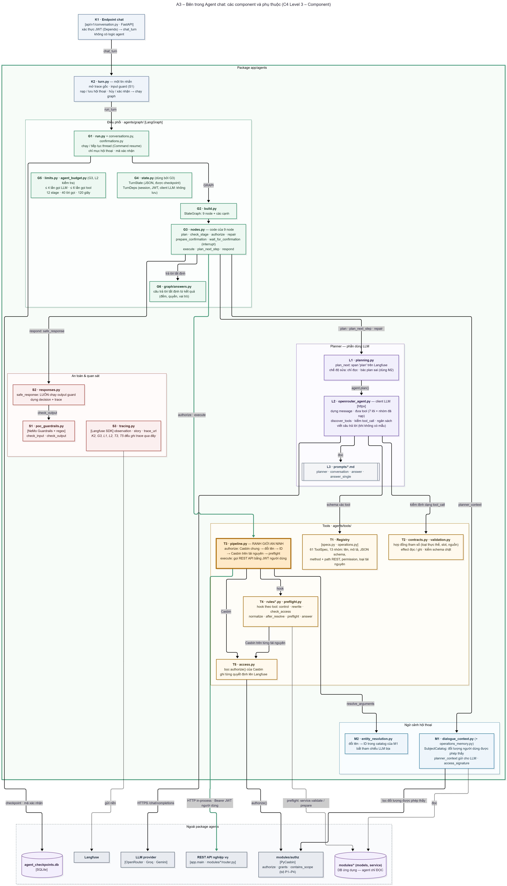
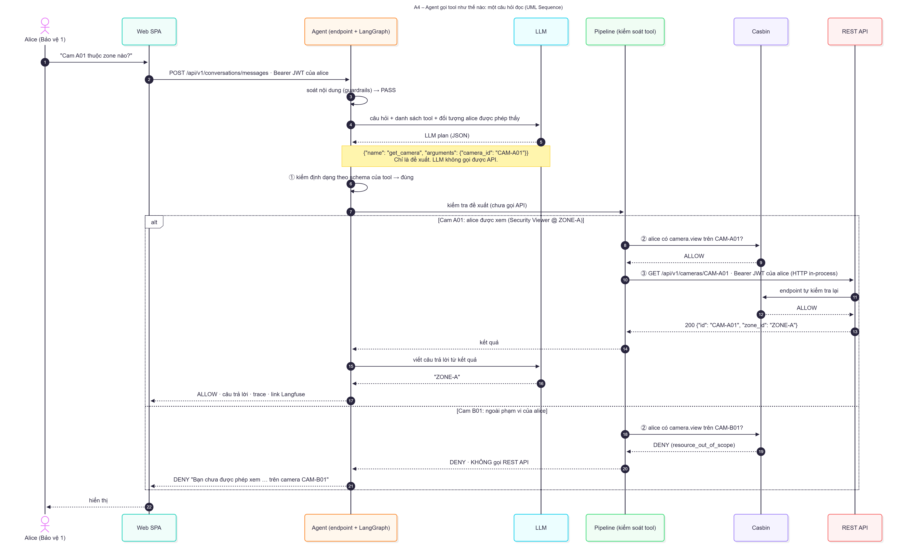

# Báo cáo: Agent chatbot

Báo cáo lần này em tập trung vào phần Agent: code Agent được tổ chức lại thế nào, Agent gọi tool và kiểm quyền thế nào, và trace log trên Langfuse.

---

## 1. Các vấn đề từ buổi báo cáo trước

- Agent: chưa rõ chạy theo mô hình nào, các cấu phần giao tiếp với nhau ra sao.
- Code Agent nằm rải rác ở `agents/`, `mcp/` và `api/v1/conversation.py` (hơn 800 dòng), chưa gom thành một khối rõ ràng.
- Chưa giải thích được LLM planner: **với mỗi câu hỏi, planner xác định làm gì và làm như thế nào**.
- Chưa rõ Agent gọi API (tool) thế nào, và ai quyết định ALLOW / DENY.
- Trace log còn mờ, chưa thấy Agent plan gì, gọi tool nào, rẽ nhánh ra sao. Nên đưa sang Langfuse.

---

## 2. Những vấn đề giải quyết trong báo cáo này

- [Cấu trúc code Agent sau khi tổ chức lại](#cau-truc-code)
- [Agent chạy theo mô hình nào](#mo-hinh)
- [A1 – System Context Diagram](#a1)
- [A2 – Container Diagram](#a2)
- [A3 – Component Diagram](#a3)
- [A4 – Một câu hỏi đi qua Agent (Sequence Diagram)](#a4)
- [Trace log trên Langfuse](#trace)

---

## 3. Tổng quan Agent

Bốn ý chính:

- **Agent không phải service riêng.** Nó là package `backend/app/agents/`, chạy **trong cùng process FastAPI** với REST API. Cửa vào duy nhất là `POST /api/v1/conversations/messages`.
- **LLM không gọi API.** LLM chỉ trả về **một đề xuất dạng JSON** (gọi tool nào, tham số gì). Code của backend kiểm tra rồi mới gọi API thật.
- **Tool chính là REST API có sẵn.** Agent gọi tool bằng một HTTP request thật vào chính backend, mang **JWT của người đang chat**. Agent không có quyền riêng: người dùng không tự làm được việc gì thì Agent cũng không làm được.
- **ALLOW / DENY do Casbin quyết định**, không phải LLM.

Dùng 4 sơ đồ, đi từ tổng quát vào chi tiết:

| Sơ đồ | Trả lời câu hỏi | Loại sơ đồ |
|---|---|---|
| A1 | Agent nói chuyện với ai bên ngoài, dữ liệu nào đi ra ngoài | C4 System Context |
| A2 | Agent chạy ở đâu, lưu ở đâu, gọi API theo đường nào | C4 Container |
| A3 | Bên trong Agent gồm những khối code nào | C4 Component |
| A4 | Một câu hỏi đi qua Agent theo thứ tự nào | Sequence |

---

## 4. Cấu trúc code Agent sau khi tổ chức lại

Em đã gom toàn bộ code Agent vào package `backend/app/agents/`:

- `api/v1/conversation.py` giảm từ hơn 800 dòng xuống **22 dòng**: chỉ xác thực JWT rồi gọi vào Agent.
- Thay vòng lặp tự viết (`workflow_runner.py`) bằng **LangGraph**.
- Mỗi tool khai báo một lần trong registry. Quy tắc riêng của từng tool tách thành hook trong `tools/rules/`.

---

## 5. Vấn đề 1: Agent chạy theo mô hình nào

Agent là **một agent duy nhất, dùng tool calling, lập kế hoạch từng bước (kiểu ReAct)**. Việc điều phối do **LangGraph** làm.

- **Một agent, không phải multi-agent.** Chỉ có một client LLM (`openrouter_agent.py`) và một bộ tool.
- **Lập kế hoạch từng bước, không lập toàn bộ kế hoạch từ đầu.** Mỗi lần LLM chỉ đề xuất **một bước** (1–5 lời gọi tool) kèm cờ `continue_after`. Chạy xong bước đó, LLM xem kết quả rồi mới đề xuất bước tiếp, hoặc báo kết thúc.
- **Code điều phối, LLM chỉ đề xuất.** Thứ tự các bước do đồ thị LangGraph cố định (`graph/build.py`), gồm 9 node.

---

## 6. A1 – System Context Diagram

Sơ đồ này cho thấy Aegis nói chuyện với ai bên ngoài, và dữ liệu nào đi ra khỏi hệ thống.

1. **Người dùng**: dùng web, đăng nhập bằng JWT, vừa chat với Agent vừa dùng các trang nghiệp vụ.
2. **LLM**.
3. **Langfuse Cloud**: nơi lưu trace, mỗi câu chat là một trace.
4. **Developer / người review**: vào Langfuse xem trace.
5. **Mũi tên chỉ đi một chiều:** Aegis gửi sang LLM và Langfuse, hai hệ thống này không bao giờ gọi ngược vào Aegis. LLM không có JWT, không có địa chỉ API nên không tự gọi được API nào.
6. **Dữ liệu gửi sang LLM:** câu hỏi, 4 lượt lịch sử, prompt, danh sách tool, các đối tượng người dùng được phép thấy, kết quả tool. Không gửi JWT, mật khẩu, policy Casbin.

---

## 7. A2 – Container Diagram

Sơ đồ này mở ô "Aegis" của A1 ra, cho thấy những thứ chạy hoặc lưu dữ liệu riêng.

1. **Web SPA** (React, Vite): trang Chat có khung chat, nút Xác nhận / Hủy cho thao tác ghi, bảng trace và link sang Langfuse.
2. **Backend API:** **một process** FastAPI. Ba ô bên trong (REST API nghiệp vụ, Agent chat, Phân quyền) là vùng logic để dễ trình bày, không phải ba service riêng.
3. **Hai cơ sở dữ liệu SQLite:** DB ứng dụng (bảng nghiệp vụ, `casbin_rule`, audit) và DB của Agent (checkpoint LangGraph, hội thoại, mã xác nhận).
4. **Mũi tên xanh đậm, Agent gọi tool:** Agent **không gọi hàm Python** của module nghiệp vụ. Nó gửi **HTTP request thật** vào chính REST API, chạy trong cùng process (`httpx` + `ASGITransport`, không qua mạng), mang **JWT của người đang chat**. Nhờ vậy request đi đúng đường của một request từ web: xác thực → kiểm quyền → audit.
5. **Agent hỏi quyền hai nơi:** Agent tự hỏi Casbin trước để từ chối sớm, không gọi API. Sau đó endpoint vẫn tự kiểm tra lại như mọi request khác.
6. **Agent chỉ đọc DB ứng dụng** (để dựng danh sách đối tượng và kiểm trạng thái). Mọi thao tác ghi dữ liệu nghiệp vụ đều đi qua REST API.

---

## 8. A3 – Component Diagram

Sơ đồ này mở ô "Agent chat" của A2 ra, cho thấy package `agents/` gồm những khối code nào.

1. **Cửa vào (K1, K2):** endpoint chỉ xác thực JWT; `turn.py` mở trace, soát nội dung, nạp hội thoại, chạy graph.
2. **Điều phối – LangGraph (G1–G6):** chạy hoặc tiếp tục thread, khai báo 9 node, giữ trạng thái, đặt giới hạn.
3. **Planner (L1–L3):** phần duy nhất nói chuyện với LLM, gồm client LLM, lớp bọc lập kế hoạch và các file prompt.
4. **Tools (T1–T5):** registry 61 tool, kiểm tham số, **pipeline là ranh giới an ninh**, hook riêng theo tool, bọc lời gọi Casbin.
5. **Ngữ cảnh (M1, M2):** dựng danh sách đối tượng người dùng được phép thấy; đổi tên thành ID và bắt ID do LLM bịa.
6. **An toàn & quan sát (S1–S3):** guardrails, output guard cho mọi câu trả lời, trace Langfuse.

Ba điểm chính:
- **LLM bị cô lập:** client LLM không import pipeline và không gọi API nào. Đề xuất của LLM luôn phải qua bước kiểm tham số rồi qua pipeline.
- **Chỉ có một đường tới REST API:** graph → pipeline → REST API. Trong cả package chỉ `pipeline.py` gọi vào ứng dụng FastAPI, không có "cửa sau".
- **Quyết định ALLOW / DENY nằm ở pipeline**, qua Casbin. Casbin còn được dùng ở phần ngữ cảnh, nhưng để **lọc đối tượng LLM được thấy**, không phải để quyết định chạy tool.

---

## 9. A4 – Một câu hỏi đi qua Agent (Sequence Diagram)

Sơ đồ này cho thấy một câu hỏi thật đi qua những thành phần nào theo thứ tự thời gian:

- alice ("Bảo vệ 1", Security Viewer @ ZONE-A) hỏi *"Cam A01 thuộc zone nào?"* → **ALLOW**, trả lời "ZONE-A".
- Nhánh dưới: alice hỏi *"Cam B01 thuộc zone nào?"* → **DENY**, không gọi API.

1. **Bước 1–3, vào hệ thống:** web gửi câu hỏi kèm JWT của alice; Agent soát nội dung (guardrails).
2. **Bước 4–5, hỏi LLM:** Agent gửi câu hỏi, danh sách tool và các đối tượng alice được phép thấy. LLM trả về **LLM plan** `get_camera(camera_id="CAM-A01")`. Đây chỉ là đề xuất.
3. **Bước 6, kiểm định dạng:** tool có thật, tham số đúng schema.
4. **Bước 7–9, kiểm quyền (chưa gọi API):** Casbin trả ALLOW vì alice có Security Viewer @ ZONE-A, mà CAM-A01 thuộc ZONE-A.
5. **Bước 10–13, gọi API thật:** `GET /api/v1/cameras/CAM-A01` mang JWT của alice. Endpoint tự kiểm quyền lần nữa, trả `zone_id: ZONE-A`.
6. **Bước 14–17, trả lời:** LLM viết câu trả lời từ kết quả, gửi về web kèm trace và link Langfuse.
7. **Bước 18–21, nhánh DENY (CAM-B01):** Casbin trả DENY, Agent trả lời *"Bạn chưa được phép xem … trên camera CAM-B01"* và **không gọi REST API**.

Với thao tác **ghi** (ví dụ đổi vai trò), graph còn **dừng lại chờ người dùng bấm Xác nhận**. Khi bấm, quyền và trạng thái được kiểm tra lại rồi mới gọi API ghi.

---

## 10. Trace log trên Langfuse

Mỗi tin nhắn chat là **một trace trên Langfuse**. Trong trace có:

- Các bước đánh số theo đúng thứ tự Agent chạy, kèm một đoạn tóm tắt bằng lời (`story`).
- Từng lần gọi LLM: prompt đầy đủ, danh sách tool đưa cho LLM, JSON LLM trả về, số token.
- Từng đề xuất bị backend bác và lý do.
- Từng quyết định Casbin (ai, quyền gì, trên tài nguyên nào, ALLOW / DENY).
- Từng lời gọi API, kèm tham số.
